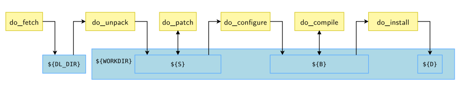
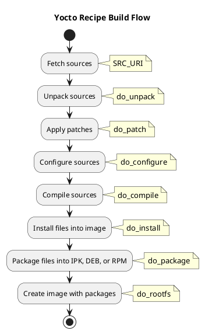
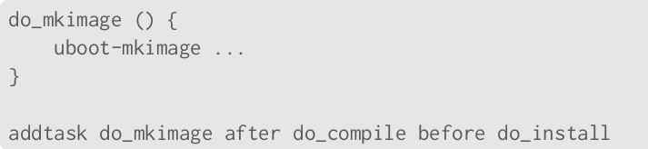

# Udemy - Embedded Linux using Yocto


- run the command "ps ax" inside the bbb and check if the /sbin/init is the first process
- type the sys and press tab. Check on output console the commands starting by sys*
- check on dmesg the messages started by systemd

## Courses resume

* [Embedded Linux using Yocto - Part 1.](Part1.md).
* [Embedded Linux using Yocto - Part 2.](Part2.md)
* [Embedded Linux using Yocto - Part 3.](Part3.md)
* [Embedded Linux using Yocto - Part 4.](Part4.md)

## Yocto Project Quick Build

See link: https://docs.yoctoproject.org/brief-yoctoprojectqs/index.html#yocto-project-quick-build

1. Requirements

- At least 90 Gbytes of free disk space.
- At least 8 Gbytes of RAM (I recommend to add 16GB of swap).
- Git 1.8.3.1 or greater; tar 1.28 or greater; Python 3.8.0 or greater; gcc 8.0 or greater; GNU make 4.0 or greater

2. Install essential host packages on your build host

```console
$ sudo apt install gawk wget git diffstat unzip texinfo gcc build-essential chrpath socat cpio python3 python3-pip python3-pexpect xz-utils debianutils iputils-ping python3-git python3-jinja2 libegl1-mesa libsdl1.2-dev python3-subunit mesa-common-dev zstd liblz4-tool file locales libacl1
$ sudo locale-gen en_US.UTF-8
```

3. Clone Poky

```console
$ git clone -b kirkstone git://git.yoctoproject.org/poky
```

## Bitbake commands

List of general BitBake commands:

| Command | Description |
| --- | --- |
| `bitbake -h` | Show some command options. |
| `bitbake <image-name>` | Build the image-name, per example, `bitbake core-image-minimal`. |
| `bitbake -k <image-name>` | Build the image-name and continue as much as possible after an error. |
| `bitbake -e <image-name> \| grep ^<variable-name>` | Check the variable value from a image-name. For example, `bitbake -e core-image-minimal \| grep ^IMAGE_INSTALL` |
| `bitbake-getvar` | Lists each configuration file touching the variable, the pre-expansion value and the final value. For example, `bitbake-getvar DEPLOY_DIR` |
| `bitbake-layers show-layers` | Shows the currently configured layers. |
| `bitbake-layers create-layer` | Create a new layer. |
| `bitbake-layers add-layer <layer>` | Adds a layer to the configuration. |
| `bitbake-layers remove-layer <layer>` | Removes a layer from the configuration. |
| `bitbake-layers show-recipes` | Shows the recipes provided by the currently configured layers. |
| `bitbake-layers show-recipes <recipe>` | Shows the recipes provided by the currently configured layers filtered by <recipe>. For example: `bitbake-layers show-recipes 'linux-*'` |
| `bitbake-layers show-overlayed` | List the layers that have been added on top of the base layers in your build configuration. |
| `bitbake-layers show-appends` | List bbappend files and the recipes they apply to. |
| `bitbake <recipe>` | Builds a recipe. |
| `bitbake -k <recipe>` or `bitbake -k` | Continues as much as possible after an error. |
| `bitbake -v <recipe>` | Gives verbose output. |
| `bitbake -e <recipe>` | Shows the environment variables for a recipe. |
| `bitbake -c listtasks <recipe>` | List all the tasks (in alphabetic order) that are available for a specific recipe. For example, bitbake -c listtasks virtual/kernel will list all the tasks for the virtual/kernel recipe. |
| `bitbake -c <task> <recipe>` | Runs a specific task for a recipe. |
| `bitbake -c clean <recipe>` | Removes all output files for a recipe. |
| `bitbake -c cleansstate <recipe>` | Removes all output files and shared state cache for a recipe. |
| `bitbake -c cleanall <recipe>` | Removes all output files, shared state cache, and downloaded source files for a recipe. |
| `bitbake -c devshell <recipe>` | Opens a shell with the environment set up for development/debugging of the recipe. |
| `bitbake -c fetch <recipe>` | Fetches the source files for a recipe. |
| `bitbake -c compile <recipe>` | Compiles the source files for a recipe. |
| `bitbake -c package <recipe>` | Creates packages from the compiled files for a recipe. |
| `bitbake -c deploy <recipe>` | Deploys the packages for a recipe. |
| `bitbake -s \| grep ^<name>` | List all recipes start with `<name>`, for example, `bitbake -s \| grep ^python3` |

Remember to replace `<recipe>` and `<task>` with the actual recipe name and task name respectively. For example, to work through `virtual/kernel`, we can use the some commands as shown below:

| Command | Description |
| --- | --- |
| `bitbake virtual/kernel` | Builds the kernel. |
| `bitbake -f virtual/kernel` | Force the `virtual/kernel` recipe to run all tasks. |
| `bitbake -c compile virtual/kernel` | Compiles the kernel source code. |
| `bitbake -c clean virtual/kernel` | Removes all output files for the kernel. |
| `bitbake -c cleansstate virtual/kernel` | Removes all output files and shared state cache for the kernel. |
| `bitbake -c cleanall virtual/kernel` | Removes all output files, shared state cache, and downloaded source files for the kernel. |
| `bitbake -c devshell virtual/kernel` | Opens a shell with the environment set up for development/debugging of the kernel. |
| `bitbake -c menuconfig virtual/kernel` | Opens the kernel configuration menu (menuconfig). |
| `bitbake -c savedefconfig virtual/kernel` | Saves the current kernel configuration to the defconfig file. |
| `bitbake -c diffconfig virtual/kernel` | Shows the differences between the old and new kernel configuration. |
| `bitbake -c fetch virtual/kernel` | Fetches the kernel source files. |
| `bitbake -c deploy virtual/kernel` | Deploys the kernel image and modules. |
| `bitbake -c package virtual/kernel` | Creates packages from the compiled kernel files. |
| `bitbake -c listtasks virtual/kernel` | Gives a list of the available tasks for the recipe providing the package `virtual/kernel`. Tasks are prefixed with do_. |

## Yocto variables

We can use the `bitbake-getvar` to understand and debug how variables are assigned. This command lists each configuration file touching the variable, the pre-expansion value and the final value. For example:

```console
$ bitbake-getvar DEPLOY_DIR
NOTE: Starting bitbake server...
#
# $DEPLOY_DIR [2 operations]
#   set? /media/yocto_partition/Yocto/BBB_Bootlin/build_bbb/../layers/poky/meta/conf/bitbake.conf:440
#     "${TMPDIR}/deploy"
#   set /media/yocto_partition/Yocto/BBB_Bootlin/build_bbb/../layers/poky/meta/conf/documentation.conf:137
#     [doc] "Points to the general area that the OpenEmbedded build system uses to place images, packages, SDKs and other output files that are ready to be used outside of the build system."
# pre-expansion value:
#   "${TMPDIR}/deploy"
DEPLOY_DIR="/media/yocto_partition/Yocto/BBB_Bootlin/build_bbb/tmp/deploy"
```

The `bitbake-getvar` can dump the per-recipe variable value using the -r option, such as `bitbake-getvar -r <recipes-name> <variable-name>`.

```console
bitbake-getvar -r ncurses SRC_URI
```

Similarly, we can use  `bitbake -e <image-name> \| grep ^<variable-name>`  to check the variable value from a image-name. For example, `bitbake -e core-image-minimal \| grep ^IMAGE_INSTALL`.

| Variable | Description |
| --- | --- |
| `BPN` | This variable is a version of the PN variable with common prefixes and suffixes removed. |
| `BP` | The base recipe name and version but without any special recipe name suffix (i.e. -native, lib64-, and so forth). Defined as `${BPN}-${PV}`. |
| `PN` | (Package Name) Specifies the name of the recipe. |
| `PV` | (Package Version) Specifies the version of the software being built by the recipe. |
| `PR` | (Package Revision) Specifies the revision of the recipe. |
| `S` | (Source) Specifies the directory containing the source code that the recipe will build. |
| `D` | (Destination) Specifies the directory where the files to be packaged are placed. |
| `B` | (Build Directory) Specifies the directory where the compilation is done. |
| `WORKDIR` | Specifies the working directory where BitBake performs tasks such as unpacking source code, applying patches, compiling the source code, and installing the compiled files.. |
| `BB_NUMBER_THREADS` | Specifies the number of threads BitBake should use during the build. |
| `PARALLEL_MAKE` | Specifies the number of threads the `make` program should use during the build. |
| `DL_DIR` | Specifies the directory where BitBake stores downloaded source files. |
| `SSTATE_DIR` | Specifies the directory where BitBake stores shared state cache files. |
| `TMPDIR` | Specifies the directory where BitBake stores temporary files. |
| `MACHINE` | Specifies the target machine. |
| `DISTRO` | Specifies the target distribution. |
| `DISTRO_FEATURES` | Specifies the features to enable in the target distribution. |
| `IMAGE_INSTALL` | Specifies the packages to install in the image. |
| `IMAGE_FEATURES` | Specifies the features to enable in the image. |
| `PREFERRED_PROVIDER` | Specifies the preferred provider for a virtual package. |
| `PREFERRED_VERSION` | Specifies the preferred version for a package. |
| `BBMASK` | Specifies a pattern to prevent certain recipes from being parsed. |
| `BBLAYERS` | Specifies the layers to include in the build. |
| `LAYER_CONF_VERSION` | Specifies the version of the layer configuration file format. |
| `BBFILE_PRIORITY` | Specifies the priority of the recipes in a layer. |
| `BBFILE_PATTERN` | Specifies a pattern to match the recipes in a layer. |
| `bindir` | Specifies the `/usr/bin` path folder. |
| `libdir` | Specifies the `/usr/lib` path folder. |

Example: When using the recipe bash_5.1.bb:
- ${BPN} = "bash"
- ${PV} = "5.1"

## Dependencies

From the BitBake point of view, there are three different dependency types:
- Build time
- Execution time
- Tasks

Metadata expresses all the dependencies. OpenEmbedded Core provides a vast set of classes to handle the default task dependencies commonly used – for example, a recipe can express a build-time dependency with the DEPENDS variable and an execution-time dependence with the RDEPENDS variable.

Sometimes a recipe has dependencies on specific versions of another recipe. bitbake allows to reflect this by using:
- DEPENDS = "recipe-b (>= 1.2)"
- RDEPENDS:${PN} = "recipe-b (>= 1.2)"

The following operators are supported: =, >, <, >= and <=.

A graphical tool can be used to explore dependencies or reverse dependencies:

```console
bitbake -g -u taskexp core-image-minimal
```

## Common tasks in the recipe build flow

You can get a list of existing tasks for a recipe with:

```console
bitbake <recipe> -c listtasks
```

Here's an explanation of some task in the Yocto recipe build flow:



1. **Fetch sources (`SRC_URI`)**: This task fetches the source code from the specified location. This could be from a git repository, a tarball, or even a local directory.

2. **Unpack sources (`do_unpack`)**: This task extracts the fetched source code into a working directory for further operations.

3. **Apply patches (`do_patch`)**: This task applies any patches specified in the recipe. Patches are modifications to the source code that are not part of the original source code package.

4. **Configure sources (`do_configure`)**: This task configures the source code for building. This often involves running a configure script or similar, which checks the build environment and sets up makefiles or other build scripts.

5. **Compile sources (`do_compile`)**: This task compiles the source code into binary executables, libraries, or other types of binary output.

6. **Install files into image (`do_install`)**: This task installs the compiled binaries, libraries, etc., into a specific directory structure within a temporary staging area. This directory structure mirrors the structure of the final target system.

7. **Package files into IPK, DEB, or RPM (`do_package`)**: This task packages the installed files into package formats like IPK, DEB, or RPM. These packages are then used to create the final image.

8. **Create image with packages (`do_rootfs`)**: This task creates the final image file that can be flashed onto the target device. It does this by installing the packages created in the `do_package` task into a root filesystem image.




Tasks can be added with `addtask`.



## Other tips

 - [1. List of the available image recipes inside of Poky folder.](#1-list-of-the-available-image-recipes-inside-of-poky-folder)
 - [2. List of the available machine supported.](#2-list-of-the-available-machine-supported)
 - [3. Current kernel and root filesystem sizes](#3-current-kernel-and-root-filesystem-sizes)
 - [4. cleansstate and cleanall commands](#4-cleansstate-and-cleanall-commands)
 - [5. grep ^VARIABLE-NAME and grep VARIABLE-NAME](#5-grep-variable-name-and-grep-variable-name)
 - [6. Clean up old data from sstate-cache](#6-clean-up-old-data-from-sstate-cache)

### 1. List of the available image recipes inside of Poky folder.

```
ls poky/meta*/recipes*/images/*.bb
```

### 2. List of the available machine supported.

```
ls poky/meta*/conf/machine/*.conf
```

### 3. Current kernel and root filesystem sizes

To help you see where you currently are with kernel and root filesystem sizes, you can use two tools found in the Source Directory in the scripts/tiny/ directory:

 - ksize.py: Reports component sizes for the kernel build objects.

 - dirsize.py: Reports component sizes for the root filesystem.

### 4. cleansstate and cleanall commands

In Yocto Project, `cleansstate` and `cleanall` are two different tasks that you can run with the `bitbake -c` command. They both clean the output files for a recipe, but they do it in slightly different ways:

 - `cleanall`: This task removes all output files for a recipe. This includes the files in the `WORKDIR` directory, the shared state cache (sstate) files, and the deploy files. After running `cleanall`, you can rebuild the recipe from scratch with `bitbake`.

 - `cleansstate`: This task is similar to `cleanall`, but it does not remove the deploy files. The deploy files are the final output files of a recipe, such as images, packages, and SDKs. After running `cleansstate`, you can rebuild the recipe from scratch with `bitbake`, but the old deploy files will still be available.

In general, you should use `cleansstate` if you want to rebuild a recipe but keep the old deploy files, and `cleanall` if you want to completely remove all output files for a recipe.

### 5. grep ^VARIABLE-NAME and grep VARIABLE-NAME

The difference between these two commands lies in the use of the caret (^) symbol in the grep command. The caret is a special character in regular expressions that denotes the start of a line.

bitbake -e <recipe-name> | grep ^VARIABLE-NAME: This command will filter the output of bitbake -e <recipe-name> and only show lines that start with VARIABLE-NAME.

bitbake -e <recipe-name> | grep VARIABLE-NAME: This command will filter the output of bitbake -e <recipe-name> and show any lines that contain VARIABLE-NAME anywhere in the line, not just at the start.

### 6. Clean up old data from sstate-cache

It is possible to clean old data with:

```console
$ find sstate-cache/ -type f -atime +30 -delete
```

This removes all files that have last been accessed more than 30 days ago (for example).

## Devtool

Recommended links:
- https://www.youtube.com/watch?v=Apfwyf_yEzI&list=PLwqS94HTEwpQmgL1UsSwNk_2tQdzq3eVJ&index=57
- https://www.youtube.com/watch?v=S5cX9op1pYk&list=PLwqS94HTEwpQmgL1UsSwNk_2tQdzq3eVJ&index=58
- https://www.youtube.com/watch?v=2K2yNtt7YqI&list=PLwqS94HTEwpQmgL1UsSwNk_2tQdzq3eVJ&index=59
- https://www.youtube.com/watch?v=Z65gY6ot3Ug&list=PLwqS94HTEwpQmgL1UsSwNk_2tQdzq3eVJ&index=60
- https://www.youtube.com/watch?v=us9YE7sBDBU&list=PLwqS94HTEwpQmgL1UsSwNk_2tQdzq3eVJ&index=61

`devtool` is a command-line tool provided by the Yocto Project that simplifies the process of developing and testing changes to recipes and software. It provides a set of high-level operations that abstract away some of the complexity of working with BitBake and OpenEmbedded.

The `devtool` utility in the Yocto Project provides several commands for working with recipes. Here are some of the most common ones:

1. **`devtool add <recipe-name> <source-location>`**: This command creates a new recipe for the software at the specified `source-location`. The `source-location` can be a local path or a remote uri. It's a convenient way to add new software to your Yocto Project build.

2. **`devtool build <recipe-name>`**: This command builds the recipe with your changes. It's a convenient way to test your changes without having to rebuild the entire image.

3. **`devtool update-recipe <recipe-name>`**: This command creates a patch that represents your changes and updates the recipe to apply this patch during the build process. It's a convenient way to integrate your changes into the recipe.

4. **`devtool finish <recipe-name> <layer-path>`**: This command cleans up the workspace and moves the modified recipe back to the original layer. It's the final step in the `devtool` workflow.

5. **`devtool modify <recipe-name>`**: This command fetches the source code for a recipe and prepares it for modification. It sets up a workspace where you can make your changes to the source code.

6. **`devtool reset <recipe-name>`**: This command removes a recipe from the workspace. It's a convenient way to discard your changes and start over.

7. **`devtool upgrade <recipe-name> <new-version>`**: This command updates a recipe to a new version of the software. It fetches the new source code, updates the recipe file, and creates any necessary patches.

These commands provide a high-level interface to the BitBake and OpenEmbedded systems, making it easier to develop and test changes to recipes.

### Workflow

Here's a basic workflow for using `devtool`:

1. **Modify a recipe**: Use the `devtool modify` command to fetch the source code for a recipe and prepare it for modification. This command sets up a workspace where you can make your changes to the source code.

```bash
devtool modify recipe-name
```

2. **Make your changes**: After running `devtool modify`, you can make your changes to the source code in the workspace.

3. **Build the recipe**: Use the `devtool build` command to build the recipe with your changes.

```bash
devtool build recipe-name
```

4. **Test your changes**: After building the recipe, you can test your changes. The exact steps to do this depend on the nature of your changes and the recipe you're modifying.

5. **Update the recipe**: Once you're satisfied with your changes, use the `devtool update-recipe` command to create a patch that represents your changes and update the recipe to apply this patch during the build process.

```bash
devtool update-recipe recipe-name
```

6. **Finish the modification**: Use the `devtool finish` command to clean up the workspace and move the modified recipe back to the original layer.

```bash
devtool finish recipe-name /path/to/layer
```

In addition to these commands, `devtool` also provides commands for adding new recipes (`devtool add`), resetting the workspace (`devtool reset`), and other tasks.

Please note that the exact steps may vary depending on your specific hardware and software configuration. If you're having trouble, please provide more information about your setup.