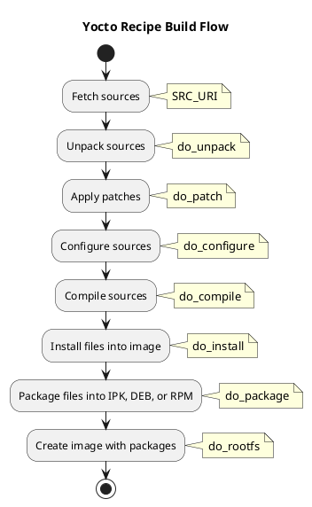

# Udemy - Embedded Linux using Yocto


- run the command "ps ax" inside the bbb and check if the /sbin/init is the first process
- type the sys and press tab. Check on output console the commands starting by sys*
- check on dmesg the messages started by systemd

## Courses resume

* [Embedded Linux using Yocto - Part 1.](Part1.md).
* [Embedded Linux using Yocto - Part 2.](Part2.md)
* [Embedded Linux using Yocto - Part 3.](Part3.md)
* [Embedded Linux using Yocto - Part 4.](Part4.md)

## Yocto Project Quick Build

See link: https://docs.yoctoproject.org/brief-yoctoprojectqs/index.html#yocto-project-quick-build

1. Requirements

- At least 90 Gbytes of free disk space.
- At least 8 Gbytes of RAM (I recommend to add 16GB of swap).
- Git 1.8.3.1 or greater; tar 1.28 or greater; Python 3.8.0 or greater; gcc 8.0 or greater; GNU make 4.0 or greater

2. Install essential host packages on your build host

```console
$ sudo apt install gawk wget git diffstat unzip texinfo gcc build-essential chrpath socat cpio python3 python3-pip python3-pexpect xz-utils debianutils iputils-ping python3-git python3-jinja2 libegl1-mesa libsdl1.2-dev python3-subunit mesa-common-dev zstd liblz4-tool file locales libacl1
$ sudo locale-gen en_US.UTF-8
```

3. Clone Poky

```console
$ git clone -b kirkstone git://git.yoctoproject.org/poky
```

## Bitbake commands

List of general BitBake commands:

| Command | Description |
| --- | --- |
| `bitbake -h` | Show some command options. |
| `bitbake <image-name>` | Build the image-name, per example, `bitbake core-image-minimal`. |
| `bitbake -k <image-name>` | Build the image-name and continue as much as possible after an error. |
| `bitbake -e <image-name> \| grep ^<variable-name>` | Check the variable value from a image-name. for example, `bitbake -e core-image-minimal \| grep ^IMAGE_INSTALL` |
| `bitbake-layers show-layers` | Shows the currently configured layers. |
| `bitbake-layers add-layer <layer>` | Adds a layer to the configuration. |
| `bitbake-layers remove-layer <layer>` | Removes a layer from the configuration. |
| `bitbake-layers show-recipes` | Shows the recipes provided by the currently configured layers. |
| `bitbake <recipe>` | Builds a recipe. |
| `bitbake -k <recipe>` or `bitbake -k` | Continues as much as possible after an error. |
| `bitbake -v <recipe>` | Gives verbose output. |
| `bitbake -e <recipe>` | Shows the environment variables for a recipe. |
| `bitbake -c listtasks <recipe>` | List all the tasks (in alphabetic order) that are available for a specific recipe. For example, bitbake -c listtasks virtual/kernel will list all the tasks for the virtual/kernel recipe. |
| `bitbake -c <task> <recipe>` | Runs a specific task for a recipe. |
| `bitbake -c clean <recipe>` | Removes all output files for a recipe. |
| `bitbake -c cleansstate <recipe>` | Removes all output files and shared state cache for a recipe. |
| `bitbake -c cleanall <recipe>` | Removes all output files, shared state cache, and downloaded source files for a recipe. |
| `bitbake -c devshell <recipe>` | Opens a shell with the environment set up for development/debugging of the recipe. |
| `bitbake -c fetch <recipe>` | Fetches the source files for a recipe. |
| `bitbake -c compile <recipe>` | Compiles the source files for a recipe. |
| `bitbake -c package <recipe>` | Creates packages from the compiled files for a recipe. |
| `bitbake -c deploy <recipe>` | Deploys the packages for a recipe. |

Remember to replace `<recipe>` and `<task>` with the actual recipe name and task name respectively. For example, to work through `virtual/kernel`, we can use the some commands as shown below:

| Command | Description |
| --- | --- |
| `bitbake virtual/kernel` | Builds the kernel. |
| `bitbake -c compile virtual/kernel` | Compiles the kernel source code. |
| `bitbake -c clean virtual/kernel` | Removes all output files for the kernel. |
| `bitbake -c cleansstate virtual/kernel` | Removes all output files and shared state cache for the kernel. |
| `bitbake -c cleanall virtual/kernel` | Removes all output files, shared state cache, and downloaded source files for the kernel. |
| `bitbake -c devshell virtual/kernel` | Opens a shell with the environment set up for development/debugging of the kernel. |
| `bitbake -c menuconfig virtual/kernel` | Opens the kernel configuration menu (menuconfig). |
| `bitbake -c savedefconfig virtual/kernel` | Saves the current kernel configuration to the defconfig file. |
| `bitbake -c diffconfig virtual/kernel` | Shows the differences between the old and new kernel configuration. |
| `bitbake -c fetch virtual/kernel` | Fetches the kernel source files. |
| `bitbake -c deploy virtual/kernel` | Deploys the kernel image and modules. |
| `bitbake -c package virtual/kernel` | Creates packages from the compiled kernel files. |

## Yocto variables

| Variable | Description |
| --- | --- |
| `PN` | (Package Name) Specifies the name of the recipe. |
| `PV` | (Package Version) Specifies the version of the software being built by the recipe. |
| `PR` | (Package Revision) Specifies the revision of the recipe. |
| `S` | (Source) Specifies the directory containing the source code that the recipe will build. |
| `D` | (Destination) Specifies the directory where the files to be packaged are placed. |
| `B` | (Build Directory) Specifies the directory where the compilation is done. |
| `WORKDIR` | Specifies the working directory where BitBake performs tasks such as unpacking source code, applying patches, compiling the source code, and installing the compiled files.. |
| `BB_NUMBER_THREADS` | Specifies the number of threads BitBake should use during the build. |
| `PARALLEL_MAKE` | Specifies the number of threads the `make` program should use during the build. |
| `DL_DIR` | Specifies the directory where BitBake stores downloaded source files. |
| `SSTATE_DIR` | Specifies the directory where BitBake stores shared state cache files. |
| `TMPDIR` | Specifies the directory where BitBake stores temporary files. |
| `MACHINE` | Specifies the target machine. |
| `DISTRO` | Specifies the target distribution. |
| `DISTRO_FEATURES` | Specifies the features to enable in the target distribution. |
| `IMAGE_INSTALL` | Specifies the packages to install in the image. |
| `IMAGE_FEATURES` | Specifies the features to enable in the image. |
| `PREFERRED_PROVIDER` | Specifies the preferred provider for a virtual package. |
| `PREFERRED_VERSION` | Specifies the preferred version for a package. |
| `BBMASK` | Specifies a pattern to prevent certain recipes from being parsed. |
| `BBLAYERS` | Specifies the layers to include in the build. |
| `LAYER_CONF_VERSION` | Specifies the version of the layer configuration file format. |
| `BBFILE_PRIORITY` | Specifies the priority of the recipes in a layer. |
| `BBFILE_PATTERN` | Specifies a pattern to match the recipes in a layer. |
| `bindir` | Specifies the `/usr/bin` path folder. |
| `libdir` | Specifies the `/usr/lib` path folder. |


## Common tasks in the recipe build flow

Here's an explanation of some task in the Yocto recipe build flow:

1. **Fetch sources (`SRC_URI`)**: This task fetches the source code from the specified location. This could be from a git repository, a tarball, or even a local directory.

2. **Unpack sources (`do_unpack`)**: This task extracts the fetched source code into a working directory for further operations.

3. **Apply patches (`do_patch`)**: This task applies any patches specified in the recipe. Patches are modifications to the source code that are not part of the original source code package.

4. **Configure sources (`do_configure`)**: This task configures the source code for building. This often involves running a configure script or similar, which checks the build environment and sets up makefiles or other build scripts.

5. **Compile sources (`do_compile`)**: This task compiles the source code into binary executables, libraries, or other types of binary output.

6. **Install files into image (`do_install`)**: This task installs the compiled binaries, libraries, etc., into a specific directory structure within a temporary staging area. This directory structure mirrors the structure of the final target system.

7. **Package files into IPK, DEB, or RPM (`do_package`)**: This task packages the installed files into package formats like IPK, DEB, or RPM. These packages are then used to create the final image.

8. **Create image with packages (`do_rootfs`)**: This task creates the final image file that can be flashed onto the target device. It does this by installing the packages created in the `do_package` task into a root filesystem image.



```plantuml
@startuml

title Yocto Recipe Build Flow

start

:Fetch sources;
note right: SRC_URI

:Unpack sources;
note right: do_unpack

:Apply patches;
note right: do_patch

:Configure sources;
note right: do_configure

:Compile sources;
note right: do_compile

:Install files into image;
note right: do_install

:Package files into IPK, DEB, or RPM;
note right: do_package

:Create image with packages;
note right: do_rootfs

stop
@enduml
```

## Other tips

 - [1. List of the available image recipes inside of Poky folder.](#1-list-of-the-available-image-recipes-inside-of-poky-folder)
 - [2. List of the available machine supported.](#2-list-of-the-available-machine-supported)
 - [3. Current kernel and root filesystem sizes](#3-current-kernel-and-root-filesystem-sizes)
 - [4. cleansstate and cleanall commands](#4-cleansstate-and-cleanall-commands)
 - [5. grep ^VARIABLE-NAME and grep VARIABLE-NAME](#5-grep-variable-name-and-grep-variable-name)

### 1. List of the available image recipes inside of Poky folder.

```
ls poky/meta*/recipes*/images/*.bb
```

### 2. List of the available machine supported.

```
ls poky/meta*/conf/machine/*.conf
```

### 3. Current kernel and root filesystem sizes

To help you see where you currently are with kernel and root filesystem sizes, you can use two tools found in the Source Directory in the scripts/tiny/ directory:

 - ksize.py: Reports component sizes for the kernel build objects.

 - dirsize.py: Reports component sizes for the root filesystem.

### 4. cleansstate and cleanall commands

In Yocto Project, `cleansstate` and `cleanall` are two different tasks that you can run with the `bitbake -c` command. They both clean the output files for a recipe, but they do it in slightly different ways:

 - `cleanall`: This task removes all output files for a recipe. This includes the files in the `WORKDIR` directory, the shared state cache (sstate) files, and the deploy files. After running `cleanall`, you can rebuild the recipe from scratch with `bitbake`.

 - `cleansstate`: This task is similar to `cleanall`, but it does not remove the deploy files. The deploy files are the final output files of a recipe, such as images, packages, and SDKs. After running `cleansstate`, you can rebuild the recipe from scratch with `bitbake`, but the old deploy files will still be available.

In general, you should use `cleansstate` if you want to rebuild a recipe but keep the old deploy files, and `cleanall` if you want to completely remove all output files for a recipe.

### 5. grep ^VARIABLE-NAME and grep VARIABLE-NAME

The difference between these two commands lies in the use of the caret (^) symbol in the grep command. The caret is a special character in regular expressions that denotes the start of a line.

bitbake -e <recipe-name> | grep ^VARIABLE-NAME: This command will filter the output of bitbake -e <recipe-name> and only show lines that start with VARIABLE-NAME.

bitbake -e <recipe-name> | grep VARIABLE-NAME: This command will filter the output of bitbake -e <recipe-name> and show any lines that contain VARIABLE-NAME anywhere in the line, not just at the start.